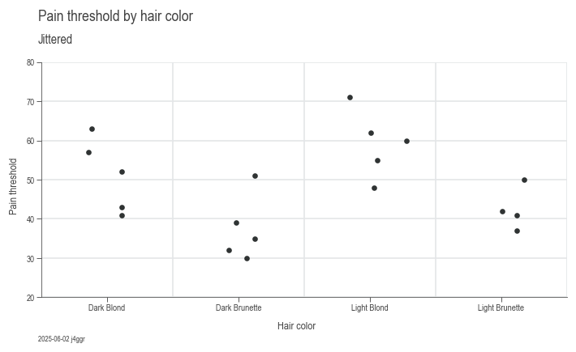
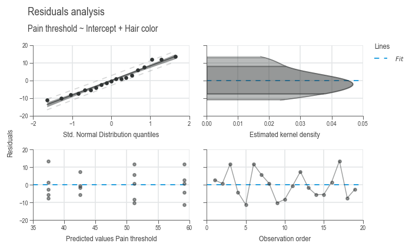

# ANOVA

## What is ANOVA?

**ANOVA**, which stands for **Analysis of Variance**, is a statistical method used to compare the means of three or more groups to determine if at least one of the group means is significantly different from the others. It helps in understanding whether the variations in data can be attributed to different factors or treatments.

## What Does ANOVA Do?

ANOVA tests the hypothesis that the means of different groups are equal. It evaluates the impact of one or more categorical independent variables on a continuous dependent variable. The main goal is to identify whether any of the group means differ significantly, implying that the independent variable(s) have an effect on the dependent variable.

### Difference Between ANOVA and Linear Regression

1. **Type of Variables:**
   - **ANOVA** is primarily used when dealing with categorical independent variables (factors) and a continuous dependent variable.
   - **Linear Regression** can handle both continuous and categorical independent variables, focusing on predicting the value of the dependent variable based on the independent variables.
2. **Purpose:**
    - **ANOVA** is used to compare means across groups and to test for differences in group means.
    - **Linear Regression** aims to model the relationship between variables and make predictions based on that relationship.
3. **Output:**
    - **ANOVA** provides insights into whether there are any statistically significant differences between group means.
   - **Linear Regression** provides coefficients that describe the relationship between the independent variables and the dependent variable.

ANOVA requires a linear model similar to linear regression, allowing for the inclusion of continuous variables. Typically, a balanced experimental design is established, where parameters are recorded as factor levels, either categorically or quasi-categorically. Additionally, continuous disturbances such as temperature and time can also be measured and incorporated into the model for evaluation in the ANOVA.

## Hypothesis Tests in ANOVA

In ANOVA, the following hypotheses are tested:

- **Null Hypothesis (H0):** All group means are equal.
- **Alternative Hypothesis (H1):** At least one group mean is different.

The test statistic used in ANOVA is the F-statistic, which is the ratio of the variance between the groups to the variance within the groups. If the F-statistic is significantly large, it suggests that the null hypothesis can be rejected.

While these hypotheses could also be tested using a t-test, it would necessitate conducting tests for all possible combinations of group pairs. This highlights a significant advantage of ANOVA: it allows us to accept or reject the null hypothesis through a single test, streamlining the analysis process.

## Distribution Basis

ANOVA is based on the F-distribution, which is used to determine the critical values for the F-statistic. The F-distribution arises from the ratio of two independent chi-squared distributions and is used to evaluate the significance of the observed variances.

## Types of ANOVA

The type of ANOVA determines how the sum of squares is partitioned among the factors. The [SAS/STAT](https://www.sas.com/en_us/software/stat.html) and also [Minitab](https://www.minitab.com/en-us/products/minitab/) software uses Type III by default. This type is also the only one who gives us a sum of square value (SS) and a p-value for the Intercept. So Type-III is also used internaly for evaluating the least significant term. A discussion on which one to use can be found at [StackExchange](https://stats.stackexchange.com/a/93031). A nice conclusion about the differences between the types:

- **Typ-I:** We choose the most "important" independent variable and it will receive the maximum amount of variation possible.
- **Typ-II:** We ignore the shared variation: no interaction is assumed. If this is true, the Type II Sums of Squares are statistically more powerful. However if in reality there is an interaction effect, the model will be wrong and there will be a problem in the conclusions of the analysis.
- **Typ-III:** If there is an interaction effect and we are looking for an “equal” split between the independent variables, Type-III should be used. [[1]](#1)

source: [Towards Data Science](https://towardsdatascience.com/anovas-three-types-of-estimating-sums-of-squares-don-t-make-the-wrong-choice-91107c77a27a)

## Example

Research from the University of Melbourne indicates potential differences in pain thresholds between blonds and brunettes. Participants, including men and women of various ages, were classified into four hair color categories: light blond, dark blond, light brunette, and dark brunette. We will now examine this dataset to explore the relationship between hair color and pain perception. [[2]](#2)

To begin with, we will take an exploratory look at the data:

``` py
import daspi as dsp

df = dsp.load_dataset('anova')
chart = dsp.SingleChart(
        source=df,
        target='Pain threshold',
        feature='Hair color',
        categorical_feature=True,
    ).plot(
        dsp.Jitter
    ).label(
        feature_label=True,
        target_label=True,
    )
```



Visually they seem to be different, now we test against the hypothesis that they are not:

``` py
model = dsp.LinearModel(df, 'Pain threshold', ['Hair color'])
model.fit()
model.anova()
```

| Typ-II | DF | SS | MS | F | p | n2 |
| :-- | :--: | --: | --: | --: | --: | --: |
| Source |  |  |  |  |  |  |
| Hair color | 3 | 1360.726316 | 453.575439 | 6.791407 | 0.004114 | 0.575962 |
| Residual | 15 | 1001.800000 | 66.786667 | NaN | NaN | 0.424038 |

The columns explained from left to right:

- **Typ-II:** Which ANOVA type was performed
- **DF:** degree of freedom, equal to the number of observed groups minus 1
- **SS:** sum of squares
- **MS:** mean squares
- **F:** F-statistic value
- **p:** p-value as the probability that the null hypothesis is true
- **n2:** $\eta^2$ Is the ratio of SS to the sum of all SS. It indicates how much of the total variance can be explained with this factor level. n2 of Residual therefore corresponds to the unexplained variance

The alpha risk, or Type I error, is the probability of incorrectly rejecting a true null hypothesis, typically set at $\alpha=0.05$. It indicates the chance of finding a false positive in hypothesis testing. Since our p-value for hair color is less than alpha, we can assume that hair color has a statistically significant influence on how much pain we can tolerate... 😉

### Influence

The influence $\tau$ of the individual groups is calculated from the group mean values to the overall mean value.

``` py
x_bar = df['Pain threshold'].mean()
x_bar_group = df.groupby('Hair color')['Pain threshold'].mean()
x_bar_group - x_bar
```

``` console
Hair color
Dark Blond         3.357895
Dark Brunette     10.442105
Light Blond       11.357895
Light Brunette     5.342105
Name: Pain threshold, dtype: float64
```

This influence can be displayed using the following command:

``` py
LEVEL = 0.95
chart = dsp.SingleChart(
        source=df,
        target='Pain threshold',
        feature='Hair color',
        categorical_feature=True,
    ).plot(
        dsp.MeanTest, confidence_level=LEVEL, show_center=False
    ).plot(
        dsp.CenterLocation
    ).stripes(
        mean=True
    ).label(
        fig_title='Pain threshold by hair color',
        sub_title=f'Mean and {int(100*LEVEL)} % confidence interval',
        feature_label=True,
        target_label=True,
    )
```


The group means are shown as blue dots and the overall mean as a gray dashed line.

### Uncertainty of the model

So far we have determined the predicted values of the model. Since the predicted values were determined from samples, these values have an uncertainty. We can quantify this uncertainty by using the error term from the ANOVA table as the mean squares of the residuals $MS_{resid}$. The uncertainty $s$ is calculated as follows: [[3]](#3)

$$s=\sqrt{MS_{resid}}$$

``` py
print(model.uncertainty)
```

``` console
2.374692962609412
```

## Statistical requirements

Before we can use our mathematical model, we must check whether the statistical requirements are met:

1. The residuals of the mathematical model are normally distributed.
2. The residuals are homogeneous, i.e. they have constant variance, regardless of the adjustment value.
3. The residuals have a mean of 0.
4. The residuals of the mathematical model are independent.

We can check these four points graphically using the following command. Each subplot corresponds to one of these four points in order from top left to bottom right. [[4]](#4)

``` py
chart = dsp.ResiduesCharts(model).plot().label()
```



## References

<a id="1">[1]</a> Joos K (2019). ANOVA’s three types of estimating Sums of Squares: don’t make the wrong choice! [Towards Data Science](https://towardsdatascience.com/anovas-three-types-of-estimating-sums-of-squares-don-t-make-the-wrong-choice-91107c77a27a)

<a id="2">[2]</a> McClave and Dietrich (1991). Pain Thresholds of Blonds and Brunettes.

<a id="3">[3]</a> Almut Melzer (2015: 169). Six Sigma – Kompakt und praxisnah. Springer Gabler

<a id="4">[4]</a> Almut Melzer (2015: 169-170). Six Sigma – Kompakt und praxisnah. Springer Gabler
