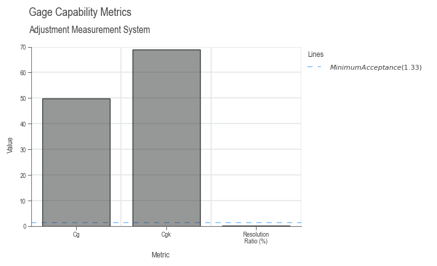
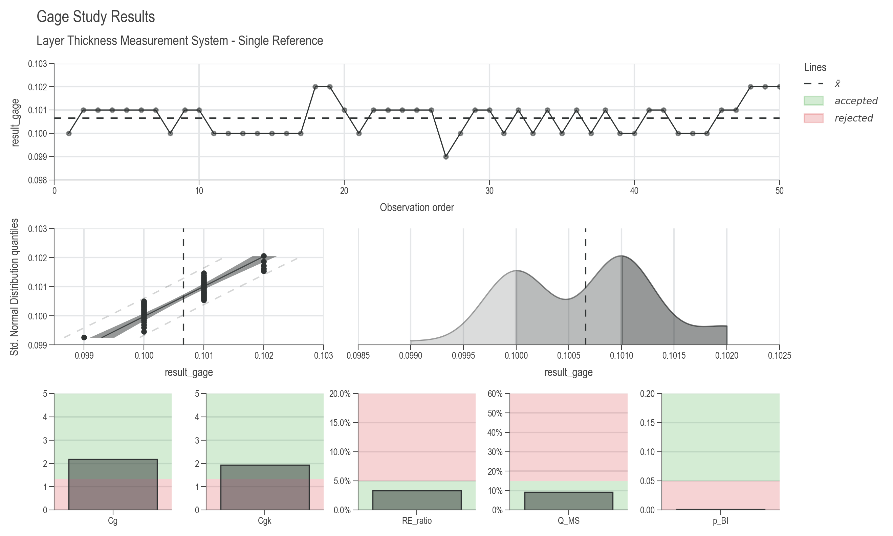
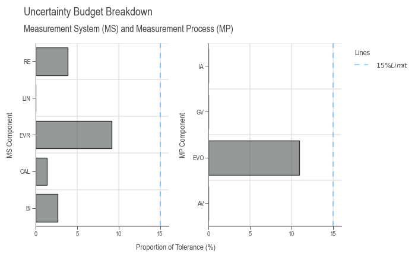
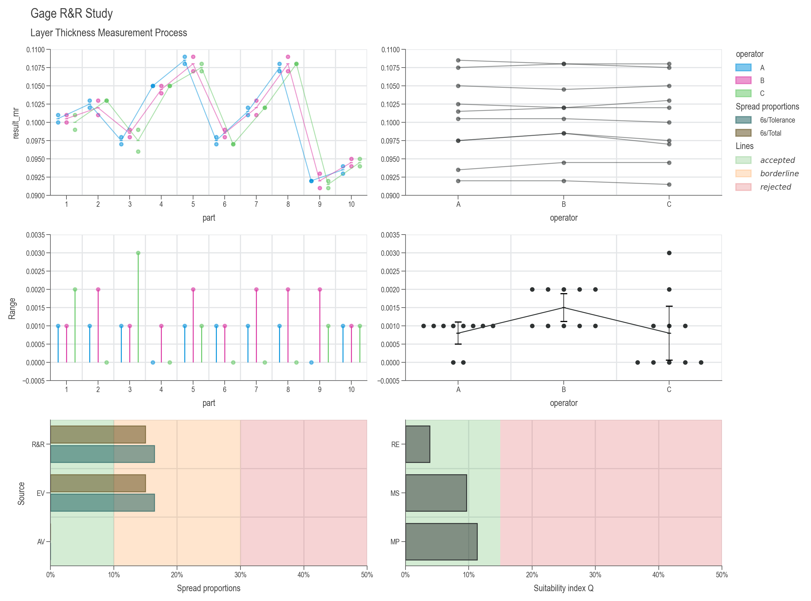

# Gage R&R Guide

## Introduction

Measurement System Analysis (MSA) is a critical component of quality management and process improvement. It provides methods to evaluate and quantify the variation in a measurement system, ensuring that your measurement process is capable and reliable before making decisions based on the data it produces.

This guide covers the complete workflow for gage analysis in DaSPi, including:

- **Gage Study (MSA Type 1)**: Evaluates the measurement system itself using a single reference
- **Gage R&R (MSA Type 2 & 3)**: Evaluates repeatability and reproducibility with multiple parts and operators

## Why Measurement System Analysis Matters

Before analyzing process variation, you must ensure your measurement system is capable. A poor measurement system can lead to:

- Incorrect conclusions about process capability
- Wrong decisions about product conformance
- Wasted resources investigating "problems" that don't exist
- Failure to detect real quality issues

The golden rule: **Measurement variation should be small compared to process variation and specification limits.**

## Standard Uncertainty Components

The following table shows the typical standard uncertainties as they affect measurements. They are divided into Measurement System (MS) and Measurement Process (MP). The individual standard uncertainty components can be determined using method A or B. The method B refers to prior knowledge or information from manuals or specifications and the method A refers to statistical analysis.

| Shortcut | Uncertainty Component                                | Impact | Method |
| :------: | :--------------------------------------------------- | :----: | :----: |
|  `CAL`   | Calibration of the reference                         |   MS   |   B    |
|   `RE`   | Display resolution                                   |   MS   |   B    |
|   `BI`   | Bias                                                 |   MS   |  A/B   |
|  `LIN`   | Linearity deviation                                  |   MS   |  A/B   |
|  `EVR`   | Equipment Variation (repeatability) on the reference |   MS   |   A    |
|  `MPE`   | Maximum Permissible Error (error limit)              |   MS   |   B    |
|  `EVO`   | Equipment Variation (repeatability) on the object    |   MP   |   A    |
|   `AV`   | Appraiser Variation (comparability of operators)     |   MP   |   A    |
|   `GV`   | Gage Variation (comparability of measurement system) |   MP   |   A    |
|   `IA`   | Interactions                                         |   MP   |   A    |
|   `T`    | Temperature                                          |   MP   |  A/B   |
|  `STAB`  | Stability over time                                  |   MP   |   A    |
|  `OBJ`   | Inhomogeneity of the object                          |   MP   |  A/B   |
|  `REST`  | Other uncertainties not covered by the above         | MS/MP  |   B    |

---

## MSA Type 1: Gage Study

### Overview

A **Gage Study** (MSA Type 1) evaluates the measurement system using repeated measurements of one or more reference standards. This is the foundation for understanding your measurement system's basic performance.

### When to Use

- Qualifying a new measurement system
- Verifying measurement system performance over time
- Determining measurement uncertainty for a single gage
- Checking for bias and linearity across the measurement range

### Quick Start Example

```python
import daspi as dsp

# Load example data
df = dsp.load_dataset('grnr_adjustment')

# Create a GageEstimator for a single reference
gage = dsp.GageEstimator(
    samples=df['result_gage'],
    reference=df['reference'][0],      # True reference value
    u_cal=df['U_cal'][0],              # Calibration uncertainty
    tolerance=df['tolerance'][0],       # Specification tolerance
    resolution=df['resolution'][0]      # Gage resolution
)

# View the results
print(gage.describe())
```

### Understanding the Output

The `GageEstimator` provides several key metrics:

```python
import daspi as dsp
df = dsp.load_dataset('grnr_adjustment')
gage = dsp.GageEstimator(
    samples=df['result_gage'],
    reference=df['reference'][0],
    u_cal=df['U_cal'][0],
    tolerance=df['tolerance'][0],
    resolution=df['resolution'][0]
)
print(gage.describe())
```

|                  | result_gage |
| ---------------: | ----------: |
|        n_samples |    60.00000 |
|        n_missing |     6.00000 |
|        n_outlier |     0.00000 |
|              min |     1.00070 |
|              max |     1.00160 |
|                R |     0.00090 |
|             mean |     1.00081 |
|           median |     1.00080 |
|              std |     0.00013 |
|              sem |     0.00002 |
|             p_ad |   9.866e-20 |
|            lower |     0.98700 |
|            upper |     1.01300 |
|               cg |    49.73226 |
|              cgk |    68.99967 |
|             bias |     0.00081 |
|           p_bias |   3.723e-44 |
|         T_min_cg |     0.00235 |
|        T_min_cgk |     0.01044 |
|        T_min_res |     0.00200 |
| resolution_ratio |     0.00077 |

**Metrics explained:**

- **`n_samples`**: Number of measurements taken
- **`mean`**: Average of all measurements
- **`std`**: Standard deviation (repeatability)
- **`bias`**: Difference between mean and reference (mean - reference)
- **`p_bias`**: Statistical significance of bias (p-value)
- **`Cg`**: Capability index for variation (similar to Cp)
- **`Cgk`**: Capability index considering bias (similar to Cpk)
- **`resolution_ratio`**: Resolution as proportion of tolerance

**Acceptance Criteria (typical values):**

- **Cg, Cgk ≥ 1.33**: Measurement system is acceptable
- **1.00 ≤ Cg, Cgk < 1.33**: Marginal, may be acceptable depending on application
- **Cg, Cgk < 1.00**: Unacceptable, measurement system needs improvement
- **resolution_ratio < 0.05**: Resolution is adequate (5% rule)



### Multiple Reference Standards (Linearity Check)

To evaluate linearity across the measurement range, use multiple reference standards:

```python
import daspi as dsp

# Load data with multiple reference parts
df = dsp.load_dataset('grnr_layer_thickness')

# Create GageStudyModel with linearity evaluation
gage = dsp.GageStudyModel(
    source=df,
    target='result_gage',
    reference='reference',
    u_cal=df['U_cal'][0],
    tolerance=df['tolerance'][0],
    resolution=df['resolution'][0],
    bias_corrected=False  # Include bias in uncertainty
)

# Create visualization
chart = dsp.GageStudyCharts(
    gage, 
    stretch_figsize=1.5
).plot().stripes().label()

# Display model summary
gage
```

**What gets calculated:**

- Individual bias for each reference level
- Linearity uncertainty (`u_lin`)
- Combined measurement system uncertainty
- Capability indices for each reference

The output tables include:

**References Analysis:**

|       |      Ref |     mean |      Bias |        s |        R |
| :---: | -------: | -------: | --------: | -------: | -------: |
|   1   | 0.101000 | 0.100660 | -0.000340 | 0.000688 | 0.003000 |

**Gage capability:**

|          |    Value |    Limit | Capable |    T_min |
| -------: | -------: | -------: | ------: | -------: |
|       Cg | 2.179005 | 1.330000 |    True | 0.018311 |
|      Cgk | 1.932051 | 1.330000 |    True | 0.021711 |
| RE_ratio | 0.033333 | 0.050000 |    True | 0.020000 |
|     Q_MS | 0.096371 | 0.150000 |    True | 0.019274 |
|     p_BI | 0.001024 | 0.050000 |   False |      nan |

**Measurement uncertainty budget measuring process:**

|      |        u |        U |        Q |     rank |
| ---: | -------: | -------: | -------: | -------: |
|  CAL | 0.000100 | 0.000200 | 0.013333 | 4.000000 |
|   RE | 0.000289 | 0.000577 | 0.038490 | 2.000000 |
|   BI | 0.000196 | 0.000393 | 0.026173 | 3.000000 |
|  LIN | 0.000000 | 0.000000 | 0.000000 |      nan |
|  EVR | 0.000688 | 0.001377 | 0.091785 | 1.000000 |
| REST | 0.000000 | 0.000000 | 0.000000 |      nan |
|   MS | 0.000723 | 0.001446 | 0.096371 |      nan |



### Visualizing Gage Study Results

The `GageStudyCharts` class creates a comprehensive dashboard with:

1. **Measurements by Reference**: Shows variation at each reference level
2. **Probability Plot**: Checks normality of measurement errors
3. **Distribution**: Shows the shape of the measurement distribution
4. **Capability Indices**: Bar charts showing Cg, Cgk, resolution ratio, etc.

```python
# Customize the chart appearance
chart = dsp.GageStudyCharts(gage, stretch_figsize=1.5)
chart.plot()      # Create all plots
chart.stripes()   # Add reference lines and zones
chart.label(      # Add labels and titles
    fig_title='Gage Study Results',
    sub_title='Layer Thickness Measurement System'
)
# chart.save('gage_study_results.png')  # Optionally save
```

### Working with Measurement Uncertainty

The `GageStudyModel` calculates a complete uncertainty budget:

```python
# Access individual uncertainty components
print(f"Calibration uncertainty (u_cal): {gage.u_cal.expanded:.6f}")
print(f"Resolution uncertainty (u_re): {gage.u_re.expanded:.6f}")
print(f"Bias uncertainty (u_bi): {gage.u_bi.expanded:.6f}")
print(f"Linearity uncertainty (u_lin): {gage.u_lin.expanded:.6f}")
print(f"Repeatability uncertainty (u_evr): {gage.u_evr.expanded:.6f}")

# Combined measurement system uncertainty
print(f"\nCombined MS uncertainty: {gage.u_ms.expanded:.6f}")

# Check if measurement system is capable
print(f"Q_MS ratio: {gage.u_ms.expanded / gage.tolerance * 2:.4f}")
print(f"Acceptable if Q_MS < {gage.q_ms_limit}")
```

The **Q_MS ratio** indicates the proportion of tolerance consumed by measurement uncertainty. A typical limit is 0.15 (15%), meaning measurement uncertainty should not exceed 15% of the tolerance.

### Coverage Factor (k)

The coverage factor determines the confidence level of the uncertainty:

- **k = 2**: ~95% confidence interval (default)
- **k = 3**: ~99.7% confidence interval

```python
# Change coverage factor
gage.k = 3
print(f"Expanded uncertainty (k=3): {gage.u_ms.expanded:.6f}")
```

---

## MSA Type 2 & 3: Gage R&R Study

### Overview

**Gage R&R** (Repeatability and Reproducibility) extends the gage study to evaluate variation across multiple parts, operators, and/or measurement systems. This provides a comprehensive view of measurement process variation.

- **Repeatability (EV)**: Variation when the same operator measures the same part multiple times
- **Reproducibility (AV or GV)**: Variation between different operators or measurement systems
- **Interactions**: Part-operator interactions that affect measurements

### When to Use

- **MSA Type 2**: Multiple operators measure multiple parts (evaluates operator variation)
- **MSA Type 3**: Multiple measurement conditions without operator influence (e.g., different fixtures, locations, temperatures)

### Complete Gage R&R Example

```python
import daspi as dsp

# Load dataset
df = dsp.load_dataset('grnr_layer_thickness')

# Step 1: Create the Gage Study (MSA Type 1)
gage = dsp.GageStudyModel(
    source=df,
    target='result_gage',
    reference='reference',
    u_cal=df['U_cal'][0],
    tolerance=df['tolerance'][0],
    resolution=df['resolution'][0]
)

# Step 2: Create the Gage R&R Model
model = dsp.GageRnRModel(
    source=df,
    target='result_rnr',
    part='part',           # Column identifying different parts
    gage=gage,             # GageStudyModel from Step 1
    u_av='operator'        # Column identifying operators (Type 2)
    # u_gv='fixture'       # Use this instead for Type 3
)

# Step 3: Visualize Results
chart = dsp.GageRnRCharts(
    model, 
    stretch_figsize=True
).plot().stripes().label()

# Step 4: Review the model
model  # Displays comprehensive uncertainty budget
```

### Understanding Gage R&R Output

The `GageRnRModel` provides several tables:

#### 1. ANOVA Table

Shows the statistical analysis of variance sources:

```python
print(model.anova())
```

**Example output:**

|    Typ-I |   DF |       SS |       MS |          F |        p |       n2 |
| -------: | ---: | -------: | -------: | ---------: | -------: | -------: |
|   Source |      |          |          |            |          |          |
|     part |    9 | 0.001588 | 0.000176 | 261.907904 | 0.000000 | 0.979539 |
| operator |    2 | 0.000001 | 0.000000 |   0.618557 | 0.542960 | 0.000514 |
| Residual |   48 | 0.000032 | 0.000001 |        nan |      nan | 0.019947 |

**Key sources of variation:**

- **Part**: Variation between different parts (desired variation)
- **Operator**: Variation due to operators/systems
- **Part×Operator**: Interaction effects
- **Residual**: Repeatability (pure measurement variation)

**Columns explained:**

- **DF**: Degrees of freedom
- **SS**: Sum of squares
- **MS**: Mean squares
- **F**: F-statistic
- **p**: p-value for significance
- **n2**: Proportion of total variance explained

#### 2. Gage R&R Table

```python
print(model.rnr())
```

Shows the variance components breakdown:

**Repeatability and reproducibility (R&R):**

|       |       MS | MS/Total |        s |       6s | 6s/Total | 6s/Tolerance |
| ----: | -------: | -------: | -------: | -------: | -------: | -----------: |
|   R&R | 0.000001 | 0.022480 | 0.000821 | 0.004924 | 0.149932 |     0.164148 |
|    EV | 0.000001 | 0.022480 | 0.000821 | 0.004924 | 0.149932 |     0.164148 |
|    AV | 0.000000 | 0.000000 | 0.000000 | 0.000000 | 0.000000 |     0.000000 |
|    PV | 0.000029 | 0.977520 | 0.005412 | 0.032473 | 0.988696 |     1.082437 |
| Total | 0.000030 | 1.000000 | 0.005474 | 0.032844 | 1.000000 |     1.094812 |

**Interpretation:**

- R&R < 10%: Excellent
- 10% ≤ R&R < 30%: Acceptable
- R&R ≥ 30%: Unacceptable
- PV should dominate the variation
- EV should be small compared to PV
- AV should be minimal or zero if operators are consistent
  
**Columns explained:**

- **MS**: Mean square from ANOVA
- **MS/Total**: Proportion of total variance
- **s**: Standard deviation for each source
- **6s**: Six times the standard deviation (approximate range)
- **6s/Total**: Proportion of total variation
- **6s/Tolerance**: Proportion of tolerance consumed by each source

#### 3. Uncertainty Budget

```python
print(model.uncertainties())
```

Provides a complete breakdown of all uncertainty components:

**Measurement uncertainty budget:**

|         |        u |        U |        Q | rank |
| ------: | -------: | -------: | -------: | ---: |
|     CAL | 0.000100 | 0.000200 | 0.013333 |  5.0 |
|      RE | 0.000289 | 0.000577 | 0.038490 |  3.0 |
|      BI | 0.000196 | 0.000393 | 0.026173 |  4.0 |
|     LIN | 0.000000 | 0.000000 | 0.000000 |  NaN |
|     EVR | 0.000688 | 0.001377 | 0.091785 |  2.0 |
| MS_REST | 0.000000 | 0.000000 | 0.000000 |  NaN |
|      MS | 0.000723 | 0.001446 | 0.096371 |  NaN |
|     EVO | 0.000821 | 0.001641 | 0.109432 |  1.0 |
|      AV | 0.000000 | 0.000000 | 0.000000 |  NaN |
|      GV | 0.000000 | 0.000000 | 0.000000 |  NaN |
|      IA | 0.000000 | 0.000000 | 0.000000 |  NaN |
|       T | 0.000000 | 0.000000 | 0.000000 |  NaN |
|    STAB | 0.000000 | 0.000000 | 0.000000 |  NaN |
|     OBJ | 0.000000 | 0.000000 | 0.000000 |  NaN |
| MP_REST | 0.000000 | 0.000000 | 0.000000 |  NaN |
|      MP | 0.000850 | 0.001700 | 0.113305 |  NaN |

- **Measurement System (MS)**: CAL, RE, BI, LIN, EVR, REST
- **Measurement Process (MP)**: EVO, AV, GV, IA, T, STAB, OBJ, REST

Each component shows:

- **Standard uncertainty (u)**
- **Expanded uncertainty (U)** at coverage factor k
- **Proportion (Q)** relative to tolerance
- **Rank**: Importance of each component



### Customizing Gage R&R Analysis

#### Bias Correction

If you identify and correct for bias, set `bias_corrected=True`:

```python
gage = dsp.GageStudyModel(
    source=df,
    target='result_gage',
    reference='reference',
    u_cal=df['U_cal'][0],
    tolerance=df['tolerance'][0],
    resolution=df['resolution'][0],
    bias_corrected=True  # Bias is corrected, don't include in uncertainty
)
```

#### Additional Uncertainty Sources

Include temperature, stability, or object inhomogeneity:

```python
# Method A: From data (categorical column)
model = dsp.GageRnRModel(
    source=df,
    target='result_rnr',
    part='part',
    gage=gage,
    u_av='operator',
    u_t='temperature',      # Temperature effect from data
    u_stab='time_period',   # Stability over time from data
    u_obj='location'        # Object inhomogeneity from data
)

# Method B: From prior knowledge
from daspi.statistics.confidence import MeasurementUncertainty

u_temp = MeasurementUncertainty(
    error_limit=0.005,      # ±0.005 variation due to temperature
    distribution='rectangular',
    k=2
)

model = dsp.GageRnRModel(
    source=df,
    target='result_rnr',
    part='part',
    gage=gage,
    u_av='operator',
    u_t=u_temp              # Known temperature uncertainty
)
```

### Visualizing Gage R&R Results

The `GageRnRCharts` creates six diagnostic plots:

1. **Measurement by Part (by Operator)**: Shows part-to-part variation
2. **Measurement by Operator**: Shows operator consistency across parts
3. **Range by Part**: Shows within-part repeatability
4. **Range by Operator**: Shows operator repeatability
5. **Variance Components (%Spread and %Tol)**: Bar chart comparing sources
6. **Uncertainty Budget**: Shows MS, MP, and total measurement uncertainty

```python
chart = dsp.GageRnRCharts(
    model,
    spread_accepted_limit=0.1,   # 10% threshold for acceptance
    spread_rejected_limit=0.3,   # 30% threshold for rejection
    u_accepted_limit=0.15,       # 15% uncertainty threshold
    stretch_figsize=True
)

chart.plot()
chart.stripes()  # Adds acceptance zones
chart.label(
    fig_title='Gage R&R Study',
    sub_title='Layer Thickness Measurement Process'
)
# chart.save('docs/img/gage_rnr_layer_thickness.png')
```



---

## Practical Workflow

### Step-by-Step Process


**1. Define Your Measurement System**

- Identify the gage/instrument
- Determine specification limits
- Know calibration uncertainty
- Understand resolution

**2. Collect Data**

For Gage Study (Type 1):

- Measure reference standard(s) multiple times (≥ 25-50 measurements)
- Use multiple references across the measurement range for linearity

For Gage R&R (Type 2):

- Select representative parts (≥ 10 parts spanning the range)
- Have multiple operators (≥ 2-3 operators)
- Each operator measures each part multiple times (≥ 2-3 trials)
- Randomize measurement order

**3. Analyze with DaSPi**

```python
# Type 1: Gage Study
gage = dsp.GageStudyModel(source, target, reference, ...)

# Type 2/3: Gage R&R
model = dsp.GageRnRModel(source, target, part, gage, u_av, ...)
```

**4. Interpret Results**

Check acceptance criteria:

- Cg, Cgk ≥ 1.33
- %Spread < 10% (excellent) or < 30% (acceptable)
- Q_MS < 0.15 (measurement uncertainty < 15% of tolerance)

**5. Take Action**

If measurement system is unacceptable:

- Improve resolution (better gage)
- Reduce bias (calibration, correction)
- Improve repeatability (better fixturing, procedure)
- Reduce operator variation (training, standardization)
- Control environmental factors (temperature, vibration)

---

## Data Requirements

### Gage Study Dataset Structure

```python
# Columns needed for GageStudyModel:
# - target: measurement results (e.g., 'result_gage')
# - reference: reference value for each measurement
# - Additional: tolerance, resolution, calibration uncertainty (can be constants)
```

Example:
```
   result_gage  reference  tolerance  resolution  U_cal
0       0.1000      0.101       0.03       0.001  0.0002
1       0.1010      0.101        NaN         NaN     NaN
2       0.1010      0.101        NaN         NaN     NaN
...
```

### Gage R&R Dataset Structure

```python
# Columns needed for GageRnRModel:
# - target: measurement results (e.g., 'result_rnr')
# - part: part identifier
# - operator: operator identifier (Type 2) OR
# - other categorical columns for Type 3 (fixture, location, etc.)
```

Example:
```
   result_rnr  part  operator  trial
0       0.107     8         A      1
1       0.105     4         A      1
2       0.092     9         A      1
...
```

---

## Common Use Cases

### Use Case 1: New Measurement System Qualification

```python
# Collect 50 measurements on a single reference
df = collect_gage_data(reference_value=10.0, n_measurements=50)

gage = dsp.GageEstimator(
    samples=df['measurement'],
    reference=10.0,
    u_cal=0.002,
    tolerance=0.1,
    resolution=0.001
)

# Check if acceptable
if gage.cg >= 1.33 and gage.cgk >= 1.33:
    print("Measurement system is qualified!")
else:
    print("Measurement system needs improvement")
```

### Use Case 2: Periodic Verification

```python
# Check gage performance quarterly
df = dsp.load_dataset('grnr_adjustment')

gage = dsp.GageEstimator(
    samples=df['result_gage'],
    reference=df['reference'][0],
    u_cal=df['U_cal'][0],
    tolerance=df['tolerance'][0],
    resolution=df['resolution'][0]
)

# Compare to historical baseline
if gage.std > historical_std * 1.2:
    print("WARNING: Repeatability has degraded")
```

### Use Case 3: Operator Training Effectiveness

```python
# Evaluate operators before and after training
model_before = dsp.GageRnRModel(df_before, 'measurement', 'part', gage, u_av='operator')
model_after = dsp.GageRnRModel(df_after, 'measurement', 'part', gage, u_av='operator')

av_before = model_before.u_av.expanded
av_after = model_after.u_av.expanded

improvement = (av_before - av_after) / av_before * 100
print(f"Operator variation reduced by {improvement:.1f}%")
```

---

## Tips and Best Practices

### Data Collection

1. **Randomize**: Always randomize the order of measurements to avoid systematic effects
2. **Blind Studies**: Operators should not know which part they're measuring
3. **Representative Parts**: Select parts that span the full measurement range
4. **Environment**: Control temperature, humidity, and other environmental factors
5. **Sample Size**: Minimum 2 operators × 10 parts × 2 trials = 40 measurements

### Analysis

1. **Check Normality**: Use probability plots to verify normal distribution assumptions
2. **Review Residuals**: Check for patterns that might indicate unmodeled effects
3. **Interaction Effects**: If significant, investigate root causes
4. **Outliers**: Investigate and document any outliers before removing them

### Reporting

1. **Document Everything**: Gage ID, calibration status, operators, environmental conditions
2. **Visual Evidence**: Include charts in reports (use `chart.save()`)
3. **Acceptance Criteria**: Clearly state and justify your acceptance limits
4. **Action Plans**: If unacceptable, document improvement plans

---

## Troubleshooting

### Problem: High Bias

**Symptoms**: Large difference between mean and reference, low Cgk

**Solutions**:

- Calibrate the measurement system
- Check for systematic errors (fixture alignment, probe wear)
- Apply bias correction in software

```python
gage = dsp.GageStudyModel(..., bias_corrected=True)
```

### Problem: High Repeatability Variation

**Symptoms**: Large std, low Cg

**Solutions**:

- Improve fixturing/clamping
- Standardize measurement procedure
- Control environmental factors
- Consider higher-resolution gage

### Problem: High Reproducibility

**Symptoms**: Large AV or GV component in R&R

**Solutions**:

- Operator training and standardization
- Improve measurement procedure documentation
- Use fixtures/jigs to reduce operator influence
- Automate measurements if possible

### Problem: Significant Interactions

**Symptoms**: Large IA component, part×operator interaction significant

**Solutions**:

- Investigate which parts cause problems for which operators
- Check if certain parts require special handling
- Review operator technique for consistency

---

## API Reference

For detailed documentation of all classes and methods:

- [GageEstimator](../statistics/estimation/gage-estimator.md)
- [GageStudyModel](../anova/gage-study-model.md)
- [GageRnRModel](../anova/gage-rnr-model.md)
- [GageStudyCharts](../plotlib/precast/gage-study-charts.md)
- [GageRnRCharts](../plotlib/precast/gage-rnr-charts.md)
- [MeasurementUncertainty](../statistics/estimation/index.md)

---

## References

1. **VDA Band 5** (Juli 2021). Mess- und Prüfprozesse. Eignung, Planung und Management. 3. überarbeitete Auflage

2. **Measurement Systems Analysis Reference Manual**, 4th Edition (2010). Automotive Industry Action Group (AIAG)

3. **Dr. Bill McNeese**, BPI Consulting, LLC (09.2012). [ANOVA Gage R&R Part 1](https://www.spcforexcel.com/knowledge/measurement-systems-analysis-gage-rr/anova-gage-rr-part-1/)

4. **Curt Ronniger**. Software für Statistik, Schulungen und Consulting. [Mess-System-Analyse](https://www.versuchsmethoden.de/Mess-System-Analyse.pdf)

5. **Minitab, LLC** (2025). [Gage Study Methods and Formulas](https://support.minitab.com/de-de/minitab/help-and-how-to/quality-and-process-improvement/measurement-system-analysis/how-to/gage-study/crossed-gage-r-r-study/methods-and-formulas/gage-r-r-table/)
