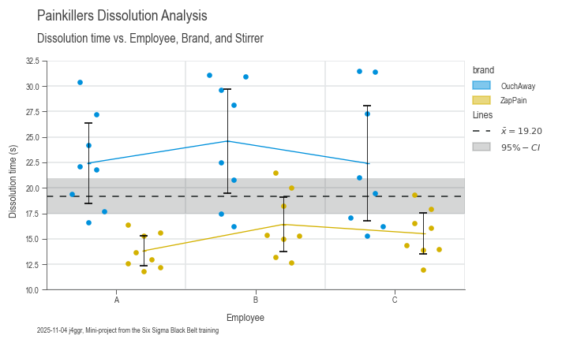

# Plotting Guide

Welcome to the wonderful world of DaSPi plotting! 🎨 Think of this as your creative toolkit for turning boring numbers into beautiful, insightful visualizations. We've built a flexible system that lets you craft everything from simple scatter plots to complex multi-panel masterpieces.

## Facets

Facets are like the stage crew of your visualization theater - they work behind the scenes to make sure everything appears in exactly the right place. They handle the layout, positioning, and all those fiddly details so you can focus on the story your data wants to tell.

### AxesFacets

Think of AxesFacets as your layout designer. This class creates the blueprint for where your subplots will live and builds the figure to house them. It's heavily inspired by Matplotlib's beloved `plt.subplots()` function (which it actually uses under the hood), but with some DaSPi magic sprinkled on top.

You have two ways to design your layout:

**Option 1: The Grid Approach** 📐

Use `nrows`, `ncols`, `width_ratios`, and `height_ratios` for clean, structured layouts:

```python
import daspi as dsp

axes = dsp.AxesFacets(
    nrows=2, ncols=2, width_ratios=[3, 1], height_ratios=[1, 3])
```

**Option 2: The Mosaic Approach** 🧩

Use the `mosaic` argument for more creative, flexible layouts:

```python
axes = dsp.AxesFacets(mosaic=[
    'aaa.',
    'bbbc',
    'bbbc',
    'bbbc'])
```

Both approaches give you the same basic layout, but mosaic has a cool trick up its sleeve - see that '.' in the top right? That tells Matplotlib to leave that space empty. It's like having a "skip this spot" instruction!

**Pro tip**: Combine mosaic with ratios for the best of both worlds:

```python
axes = dsp.AxesFacets(
    mosaic=['a.', 'bc'], width_ratios=[3, 1], height_ratios=[1, 3])
```


**Accessing Your Axes** 🎯

Getting to your individual plots is super intuitive. You can use either:
- A single number (like a flat list): `axes[1]`
- Tuple notation (like numpy arrays): `axes[-1, 0]`

Plus, AxesFacets works as an iterator, so you can loop through your axes from top-left to bottom-right. Neat!

### StripesFacets

Ever wanted to add reference lines or highlight important regions across your plots? That's where StripesFacets shines! ✨ This class adds horizontal or vertical lines and areas to your plots - perfect for showing specification limits, control limits, confidence intervals, or global statistics.

**The Problem**: Imagine you're comparing data across multiple subplots. Each subplot shows the same type of analysis but for different categories. How do you quickly spot differences between groups?

**The Solution**: Reference lines and areas that make patterns jump out at you!

Let's see this in action with painkillers dissolution data. First, the "before" picture:

```python
import daspi as dsp
import matplotlib.pyplot as plt

df = dsp.load_dataset('painkillers-dissolution')

fig, axes = plt.subplots(
    nrows=1, ncols=df['employee'].nunique(), sharex=True, sharey=True)

for ax, (name, group) in zip(axes, df.groupby('employee')):
    ax.scatter(group['temperature'], group['dissolution'])
    ax.set_title(str(name))
```


Hard to compare, right? Now watch the magic happen when we add stripes:

```python
import daspi as dsp
import matplotlib.pyplot as plt

df = dsp.load_dataset('painkillers-dissolution')

fig, axes = plt.subplots(
    nrows=1, ncols=df['employee'].nunique(), sharex=True, sharey=True)

for ax, (name, group) in zip(axes, df.groupby('employee')):
    stripes = dsp.StripesFacets(
        group['dissolution'],
        target_on_y=True,
        single_axes=False,
        mean=True,
        confidence=0.95,
        spec_limits=dsp.SpecLimits(upper=25))
    ax.scatter(group['temperature'], group['dissolution'])
    ax.set_title(str(name))
    stripes.draw(ax)
```


Now you can instantly see which employee's tablets are taking too long to dissolve! 🎯

⚠️ **Important**: When using StripesFacets across multiple subplots, set `sharey=True` so the reference lines align properly.

### LabelFacets

LabelFacets is your typography and annotation specialist. 📝 This class handles all the text elements that make your plots publication-ready: titles, subtitles, axis labels, legends, and even info boxes.

The best part? It automatically adjusts the subplot area to prevent text overlap. No more manually tweaking margins!

```python
from matplotlib.lines import Line2D
from matplotlib.patches import Patch

axes = dsp.AxesFacets(nrows=3, ncols=2, sharey=True)

legend_data={
    'Lines': [
        (Line2D([0], [0], c='r'), Line2D([0], [0], c='b')),
        ('red line', 'blue line')],
    'Patches': [
        (Patch(color='r'), Patch(color='b')), 
        ('red patch', 'blue patch')]},

labels = dsp.LabelFacets(
    axes,
    fig_title='Title',
    sub_title='Subtitle',
    xlabel=('xlabel tl', 'xlabel tr', 'xlabel cl', 'xlabel cr', 'xlabel bl', 'xlabel br'),
    ylabel='single ylabel at center',
    info='Info goes here',
    cols=('col 1', 'col 2'),
    col_title='Column title',
    rows=('row 1', 'row 2', 'row3'),
    row_title='Row title',
    legend_data=legend_data)
labels.draw()
```


### Bringing It All Together

Let's create a complete, professional-looking analysis by combining all three facet classes. We'll revisit our painkillers dissolution example and make it publication-ready:

```python
import daspi as dsp

df = dsp.load_dataset('painkillers-dissolution')

# Create the subplots layout
axes = dsp.AxesFacets(
    nrows=1, ncols=df['employee'].nunique(), sharex=True, sharey=True)

# Draw the stripes and plot data
for ax, (name, group) in zip(axes, df.groupby('employee')):
    stripes = dsp.StripesFacets(
        group['dissolution'],
        target_on_y=True,
        single_axes=False,
        mean=True,
        confidence=0.95,
        spec_limits=dsp.SpecLimits(upper=25))
    ax.scatter(group['temperature'], group['dissolution'])
    stripes.draw(ax)

# Add professional labeling
legend_data = {'Lines': stripes.handles_labels()}

labels = dsp.LabelFacets(
    axes,
    fig_title='Painkillers Dissolution Analysis',
    sub_title='Dissolution time ~ temperature + employee',
    xlabel='Temperature (°C)',
    ylabel='Dissolution time (s)',
    info='Mini-project from the Six Sigma Black Belt training',
    cols=tuple(df['employee'].unique()),
    col_title='Employee',
    legend_data=legend_data)
labels.draw()
```


From scattered data points to a professional analysis in just a few lines of code! 🚀

## Plotters

Welcome to the heart of DaSPi's visualization engine! 💖 Our plotter collection is like a Swiss Army knife for data visualization - we've got the right tool for every data story you want to tell.

### Bivariate (XY) Plots

These are your bread-and-butter relationship explorers. Perfect for answering "How does X relate to Y?" questions. The setup is always the same:

- `source`: Your DataFrame (the data buffet)
- `target`: The Y-axis variable (what you're trying to understand)
- `feature`: The X-axis variable (what might be influencing your target)


### Univariate (Distribution) Plots

When you want to get intimate with a single variable - understand its personality, quirks, and behavior patterns. These plots reveal the shape, center, and spread of your data.


### Plots for Differences

The "spot the difference" champions! 🔍 These plots excel at comparing groups and highlighting variations between categories. Perfect for answering "Are these groups really different?" questions.


### Special Plots

Our collection of specialized tools for specific analytical needs. These are the plots that make you look like a data visualization wizard! ✨


## Charts

Now for the grand finale! 🎭 We've built all these amazing components (facets and plotters), but wouldn't it be nice to have a simple way to orchestrate them all? Enter the chart classes - your new best friends for creating stunning visualizations without breaking a sweat.

Think of charts as your personal plotting assistants. They handle all the tedious setup work while you focus on the fun part: telling your data's story.

### The Chart Family

Meet the three chart siblings, each with their own personality:

- **SingleChart** - The minimalist. One plot area, infinite possibilities.
- **JointChart** - The collaborator. Loves showing relationships between variables.
- **MultiVariantChart** - The overachiever. Handles complex multi-panel layouts like a boss.

### How Charts Work Their Magic

These chart classes are essentially smart wrappers around our facet classes (AxesFacets, StripesFacets, and LabelFacets). They also provide a dead-simple interface for working with plotters. Think of them as the conductors of your data visualization orchestra! 🎼

The beauty is in their flexibility - you can mix and match plotters however you want. Just call the `plot()` method multiple times with different plotter classes. It's like building with LEGO blocks, but for data visualization!

### The Chart Creation Recipe

Here's the secret sauce for chart creation:

1. **Create your chart** - The AxesFacets class gets instantiated automatically
2. **Add your plots** - Call `plot()` as many times as you want with different plotters
3. **Sprinkle in some stripes** - Call `stripes()` to add reference lines and areas
4. **Label everything beautifully** - Call `labels()` to make it publication-ready
5. **Save your masterpiece** - Call `save()` to preserve your work

⚠️ **Pro tip**: The `labels()` method is a bit of a diva - it must be called last (but before `save()`). All other methods are more flexible and can be called in any order.

### Method Chaining Magic ✨

All methods are chainable, so you can create entire visualizations in one elegant flow:

```python
import daspi as dsp

chart = dsp.SingleChart(...
    ).plot(...
    ).stripes(...
    ).labels(...
    ).save(...)
```

It's like writing poetry, but with data! Each method flows naturally into the next, creating a readable narrative of your visualization process.

### SingleChart

The SingleChart class is perfect when you want to focus all attention on one plot area. It's like having a single spotlight on stage - everything else fades away, and your data becomes the star.

So now let's create a chart using the SingleChart class with the same data we used in the Facets section above.

```python
import daspi as dsp

df = dsp.load_dataset('painkillers-dissolution')

chart = dsp.SingleChart(
        source=df,
        target='dissolution',
        feature='employee',
        hue='brand',
        dodge=True,
    ).plot(
        dsp.Beeswarm
    ).plot(
        dsp.CenterLocation,
        show_line=True,
        show_center=False,
    ).plot(
        dsp.MeanTest,
        marker='_',
        kw_center={'size': 100}
    ).stripes(
        mean=True,
        confidence=0.95
    ).label(
        fig_title='Painkillers Dissolution Analysis',
        sub_title='Dissolution time vs. Employee, Brand, and Stirrer',
        target_label='Dissolution time (s)',
        feature_label='Employee',
        info=True
    )
```



The result? A professional-looking plot that would make any data scientist proud! 📊
