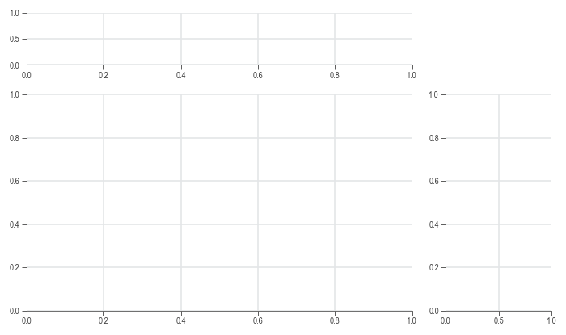
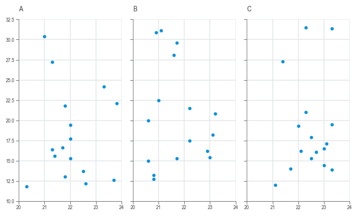
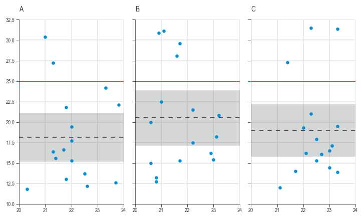
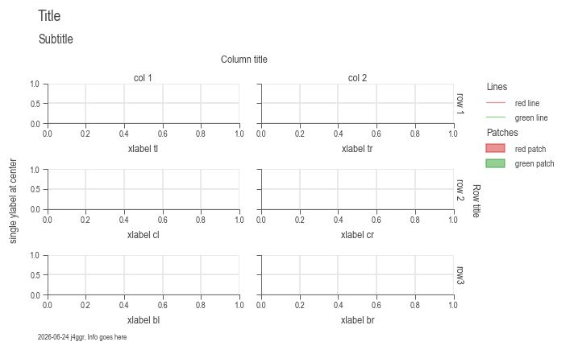
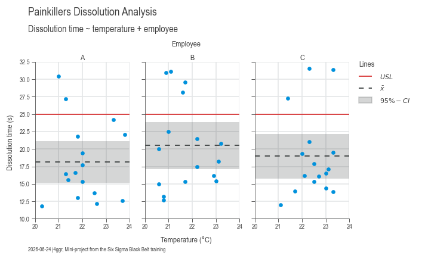
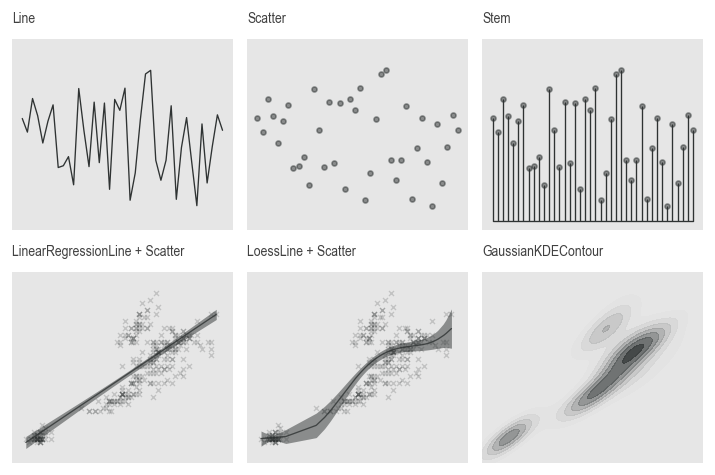
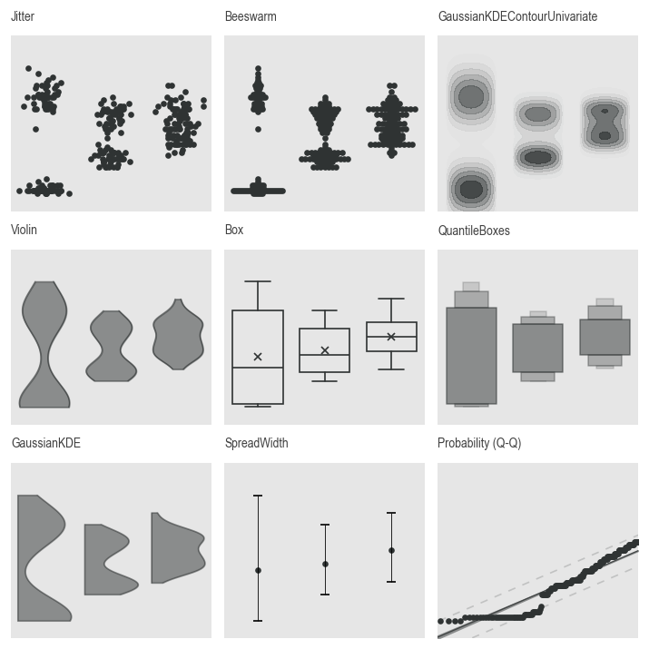
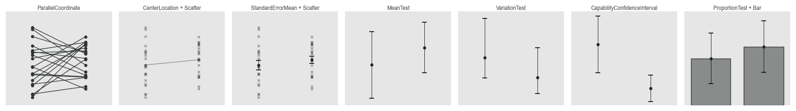
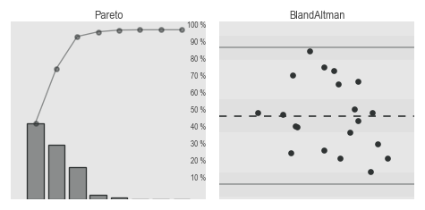
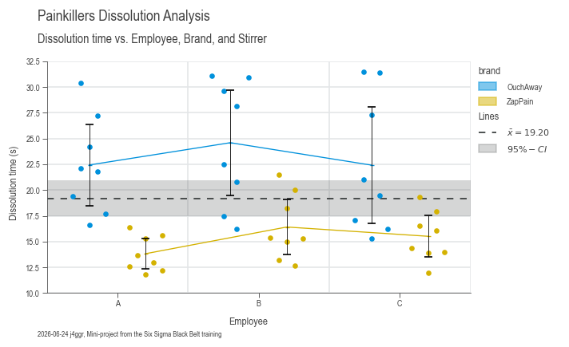

# Plotting Guide

Professional visualization is essential for effective process analytics. DaSPi provides a flexible plotting system that creates publication-ready charts for capability analysis, root cause investigations, and statistical reporting.

This guide covers DaSPi's layered plotting architecture — from simple single-panel charts to complex multi-panel layouts.

---

## Facets

Facets are the foundation of DaSPi's plotting system. They handle layout, positioning, and all the structural details so you can focus on visualizing your data effectively.

### AxesFacets

AxesFacets creates the layout blueprint for your visualizations. This class manages subplot positioning and figure construction, inspired by Matplotlib's `plt.subplots()` function with additional DaSPi enhancements.

You have two approaches for designing your layout:

**Option 1: Grid Layout**

Use `nrows`, `ncols`, `width_ratios`, and `height_ratios` for structured grids:

```python
import daspi as dsp

axes = dsp.AxesFacets(
    nrows=2, ncols=2, width_ratios=[3, 1], height_ratios=[1, 3])
```

**Option 2: Mosaic Layout**

Use the `mosaic` argument for flexible, custom layouts:

```python
axes = dsp.AxesFacets(mosaic=[
    'aaa.',
    'bbbc',
    'bbbc',
    'bbbc'])
```

Both approaches provide the same basic layout, but mosaic offers more flexibility — the '.' character tells Matplotlib to leave that space empty.

**Combining approaches:**

```python
axes = dsp.AxesFacets(
    mosaic=['a.', 'bc'], width_ratios=[3, 1], height_ratios=[1, 3])
```



**Accessing Individual Axes**

Access your subplots using:
- Single index (flat list): `axes[1]`
- Tuple notation (numpy-style): `axes[-1, 0]`

AxesFacets also works as an iterator, allowing you to loop through axes from top-left to bottom-right.

### StripesFacets

StripesFacets adds reference lines and shaded areas to your plots — essential for showing specification limits, control limits, confidence intervals, or baseline statistics.

**Use Case:** Compare data across multiple subplots where each subplot shows the same analysis for different categories. Reference lines make patterns and differences immediately visible.

Let's see this with painkillers dissolution data. First, without stripes:

```python
import daspi as dsp
import matplotlib.pyplot as plt

df = dsp.load_dataset('painkillers-dissolution')

fig, axes = plt.subplots(
    nrows=1, ncols=df['employee'].nunique(), sharex=True, sharey=True)

for ax, (name, group) in zip(axes, df.groupby('employee')):
    ax.scatter(group['temperature'], group['dissolution'])
    ax.set_title(str(name))
```



Now with stripes added:

```python
import daspi as dsp
import matplotlib.pyplot as plt

df = dsp.load_dataset('painkillers-dissolution')

fig, axes = plt.subplots(
    nrows=1, ncols=df['employee'].nunique(), sharex=True, sharey=True)

for ax, (name, group) in zip(axes, df.groupby('employee')):
    stripes = dsp.StripesFacets(
        group['dissolution'],
        target_on_y=True,
        single_axes=False,
        mean=True,
        confidence=0.95,
        spec_limits=dsp.SpecLimits(upper=25))
    ax.scatter(group['temperature'], group['dissolution'])
    ax.set_title(str(name))
    stripes.draw(ax)
```



Now you can instantly identify which employee's tablets are exceeding dissolution time limits.

!!! note "Alignment Requirement"
    When using StripesFacets across multiple subplots, set `sharey=True` so reference lines align properly.

### LabelFacets

LabelFacets handles all text elements that make your plots publication-ready: titles, subtitles, axis labels, legends, and annotation boxes.

A key feature: it automatically adjusts subplot spacing to prevent text overlap, eliminating manual margin adjustments.

```python
from matplotlib.lines import Line2D
from matplotlib.patches import Patch

axes = dsp.AxesFacets(nrows=3, ncols=2, sharey=True)

legend_data={
    'Lines': [
        (Line2D([0], [0], c='r'), Line2D([0], [0], c='b')),
        ('red line', 'blue line')],
    'Patches': [
        (Patch(color='r'), Patch(color='b')), 
        ('red patch', 'blue patch')]},

labels = dsp.LabelFacets(
    axes,
    fig_title='Title',
    sub_title='Subtitle',
    xlabel=('xlabel tl', 'xlabel tr', 'xlabel cl', 'xlabel cr', 'xlabel bl', 'xlabel br'),
    ylabel='single ylabel at center',
    info='Info goes here',
    cols=('col 1', 'col 2'),
    col_title='Column title',
    rows=('row 1', 'row 2', 'row3'),
    row_title='Row title',
    legend_data=legend_data)
labels.draw()
```



### Bringing It All Together

Let's create a complete, professional-looking analysis by combining all three facet classes. We'll revisit our painkillers dissolution example and make it publication-ready:

```python
import daspi as dsp

df = dsp.load_dataset('painkillers-dissolution')

# Create the subplots layout
axes = dsp.AxesFacets(
    nrows=1, ncols=df['employee'].nunique(), sharex=True, sharey=True)

# Draw the stripes and plot data
for ax, (name, group) in zip(axes, df.groupby('employee')):
    stripes = dsp.StripesFacets(
        group['dissolution'],
        target_on_y=True,
        single_axes=False,
        mean=True,
        confidence=0.95,
        spec_limits=dsp.SpecLimits(upper=25))
    ax.scatter(group['temperature'], group['dissolution'])
    stripes.draw(ax)

# Add professional labeling
legend_data = {'Lines': stripes.handles_labels()}

labels = dsp.LabelFacets(
    axes,
    fig_title='Painkillers Dissolution Analysis',
    sub_title='Dissolution time ~ temperature + employee',
    xlabel='Temperature (°C)',
    ylabel='Dissolution time (s)',
    info='Mini-project from the Six Sigma Black Belt training',
    cols=tuple(df['employee'].unique()),
    col_title='Employee',
    legend_data=legend_data)
labels.draw()
```



Professional analysis in just a few lines of code.

## Plotters

Plotters are the core visualization components in DaSPi. Each plotter class creates a specific type of mark (scatter, line, box plot, etc.) and can be combined to build complex analyses.

### Bivariate (XY) Plots

Bivariate plotters explore relationships between two variables. Essential parameters:

- `source`: Your DataFrame
- `target`: The Y-axis variable (response)
- `feature`: The X-axis variable (predictor)



### Univariate (Distribution) Plots

Univariate plotters analyze single variables, revealing distribution shape, center, and spread.



### Plots for Differences

Comparison plotters excel at highlighting differences between groups and categories — essential for hypothesis testing and root cause analysis.



### Special Plots

Specialized plotters for specific analytical needs including capability analysis, measurement system analysis, and advanced statistical visualizations.



## Charts

Chart classes provide a high-level interface that combines facets and plotters into a streamlined workflow. They handle setup automatically while maintaining full customization capabilities.

### The Chart Family

DaSPi provides three chart classes for different visualization needs:

- **SingleChart** — Single plot area for focused analysis
- **JointChart** — Combined marginal and joint distributions
- **MultivariateChart** — Complex multi-panel layouts

### Architecture

Chart classes are smart wrappers around facet classes (AxesFacets, StripesFacets, and LabelFacets), providing a simplified interface for working with plotters.

Key advantage: you can layer multiple plotters by calling `plot()` repeatedly with different plotter classes. Each plotter adds marks to the same axes, enabling sophisticated composite visualizations.

### Typical Workflow

1. **Create chart** — AxesFacets instantiated automatically
2. **Add plots** — Call `plot()` one or more times with different plotters
3. **Add reference lines** — Call `stripes()` to add specification or control limits
4. **Add labels** — Call `labels()` for titles, legends, and annotations
5. **Save** — Call `save()` to export

!!! note "Method Order"
    The `labels()` method must be called last (before `save()`). Other methods can be called in any order.

### Method Chaining

All chart methods return `self`, enabling fluent method chaining:

```python
import daspi as dsp

chart = dsp.SingleChart(...
    ).plot(...
    ).stripes(...
    ).labels(...
    ).save(...)
```

This creates readable, compact code that clearly expresses the visualization workflow.

### SingleChart

SingleChart provides a single plot area for focused analysis. Let's recreate the painkillers example using the chart interface:

```python
import daspi as dsp

df = dsp.load_dataset('painkillers-dissolution')

chart = dsp.SingleChart(
        source=df,
        target='dissolution',
        feature='employee',
        hue='brand',
        dodge=True,
    ).plot(
        dsp.Beeswarm
    ).plot(
        dsp.CenterLocation,
        show_line=True,
        show_center=False,
    ).plot(
        dsp.MeanTest,
        marker='_',
        kw_center={'size': 100}
    ).stripes(
        mean=True,
        confidence=0.95
    ).label(
        fig_title='Painkillers Dissolution Analysis',
        sub_title='Dissolution time vs. Employee, Brand, and Stirrer',
        target_label='Dissolution time (s)',
        feature_label='Employee',
        info=True
    )
```



The result? A professional-looking plot that would make any data scientist proud! 📊
