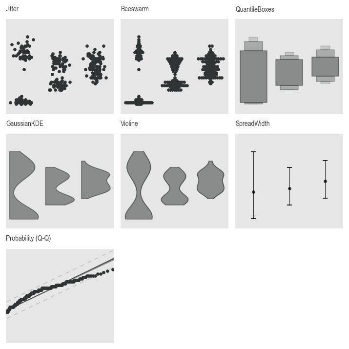

# Plotting

## Facets

The facet classes are used to place axes, labels and stripes (within the axes)  on the figure at the correct location and dimensions.

### AxesFacets

This class creates the layout for the subplots (axes) and the corresponding figure object. Initialization is heavily based on Matplotlib's `plt.subplots()` function (see [Matplotlib API](https://matplotlib.org/stable/api/_as_gen/matplotlib.pyplot.subplots.html)). This function is also called under the hood.

The layout of the subplots can be determined using the `nrows`, `ncols`, `width_ratios`, and `height_ratios` arguments, or the `mosaic` argument. You can find out more about the mosaic layout [here](https://matplotlib.org/stable/api/_as_gen/matplotlib.pyplot.subplot_mosaic.html).

Here is an example of how to use the `AxesFacets` class:

``` py
import daspi as dsp

axes = dsp.AxesFacets(
    nrows=2, ncols=2, width_ratios=[3, 1], height_ratios=[1, 3])
```

And the counterpart using the mosaic argument:

``` py
axes = dsp.AxesFacets(mosaic=[
    'aaa.',
    'bbbc',
    'bbbc',
    'bbbc'])
```

For both, you'll get the following layout, with a difference being the subplot in the top right. In the mosaic, we have a '.' there. Matplotlib interprets this as empty space and does not create an Axes object at this location. This option isn't available with the first variant. Another difference is that in the mosaic notation above, the underlying matrix has the same size as the mosaic matrix. Therefore, we use row and column spans instead of width and height ratios. This means that in this example, the Axes object is present in 9 positions in the matrix. For this reason, it is also recommended to combine Mosaic with ratios:

``` py
axes = dsp.AxesFacets(
    mosaic=['a.', 'bc'], width_ratios=[3, 1], height_ratios=[1, 3])
```


The individual axes can be retrieved using the getitem notation. Either a single number can be specified, which returns the unique Axes object in a flat list (from top left to bottom right) at the corresponding index. Alternatively, a tuple can also be specified, just like with numpy arrays. Using the example layout above, if you want the large Axes object, you have the following two options. Note that there is no Axes object in the top right corner.

``` py
axes[1]
axes[-1, 0]
```

The AxesFacets object also serves as an iterator. Like indexing, iterates over the Axes objects from top left to bottom right.

### LabelFacets

With this class you can add figure titles, subtitles, axis labels, column and row labels, a figure legend outside the axes or an info text at the bottom left of the diagram.

These facets are added to the Figure object as matplotlib.Text objects. The subplot area is automatically resized to prevent overlap.

``` py
from matplotlib.lines import Line2D
from matplotlib.patches import Patch

axes = dsp.AxesFacets(nrows=3, ncols=2, sharey=True)

legend_data={
    'Lines': [
        (Line2D([0], [0], c='r'), Line2D([0], [0], c='b')),
        ('red line', 'blue line')],
    'Patches': [
        (Patch(color='r'), Patch(color='b')), 
        ('red patch', 'blue patch')]},

labels = dsp.LabelFacets(
    axes,
    fig_title='Title',
    sub_title='Subtitle',
    xlabel=('xlabel tl', 'xlabel tr', 'xlabel cl', 'xlabel cr', 'xlabel bl', 'xlabel br'),
    ylabel='single ylabel at center',
    info='Info goes here',
    cols=('col 1', 'col 2'),
    col_title='Column title',
    rows=('row 1', 'row 2', 'row3'),
    row_title='Row title',
    legend_data=legend_data)
labels.draw()
```


## Plotters

The plotting library within DaSPi offers a wide selection of different plotters. Here's an overview of the different types and what they look like in use.

### Bivariate (XY) Plots

This is the most common type of plot, and it is used to visualize the relationship between two variables. The plotter uses the following parameters:
- `source`: The source data frame.
- `target`: The target variable (Y-axis).
- `feature`: The feature variable (X-axis).

The available plotters are:


### Univariate (distribution) Plots

These types of plots are used to show the location and/or spread of the data points. The target variable is always continuous and the features are either absent or categorical.



### Plots for differences

These types of plots are used to show the difference between two or more variables. The target variable is always continuous and the features must be categorical.


### Special Plots

Here are some application-specific but still helpful plots.


Here an example of a loess line plot in combination with a scatter plot:

``` py
import daspi as dsp

df = dsp.load_dataset('iris')
axes = dsp.AxesFacets(nrows=1, ncols=1)
kwds = dict(
    source=df,
    target='length',
    feature='width',
    color=dsp.DEFAULT.PLOTTING_COLOR,
    ax=axes[0])

loess_plot = dsp.LoessLine(show_ci=True, **kwds)
loess_plot()
scatter_plot = dsp.Scatter(**kwds)
scatter_plot()
```

