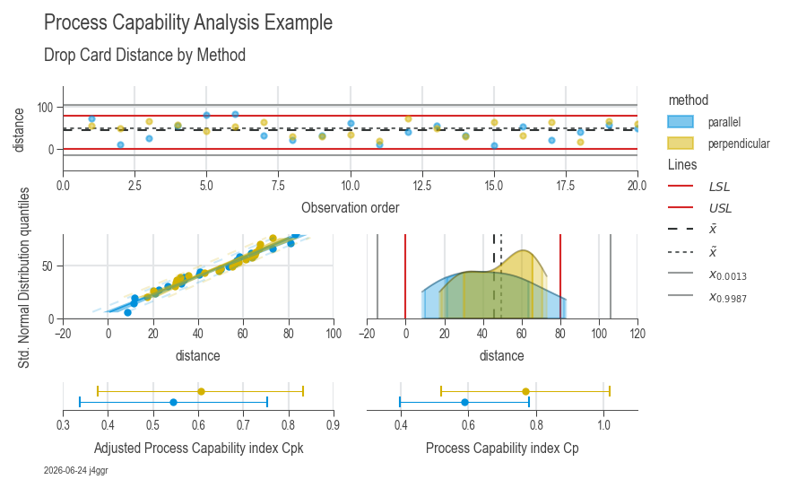

# Workflow 1: Process Capability Analysis

Process capability analysis evaluates whether your process can consistently meet specification limits. This is essential for Six Sigma DMAIC projects, quality control, and manufacturing validation.

---

## When to Use This Workflow

- ✅ **Quality verification:** Check if process meets customer specifications
- ✅ **Process validation:** Demonstrate capability for new products or processes
- ✅ **Continuous improvement:** Benchmark performance over time
- ✅ **Supplier qualification:** Assess supplier quality capability

---

## Quick Start (8 Lines)

```python
import daspi as dsp

# Load your data
df = dsp.load_dataset("drop_card")
spec_limits = dsp.SpecLimits(0, float(df.loc[0, "usl"]))

# Run analysis
chart = dsp.ProcessCapabilityAnalysisCharts(
    source=df,
    target="distance",
    spec_limits=spec_limits,
    hue="method"
).plot().stripes().label(info=True)

chart.show()
```


*Example output: 5-panel capability analysis showing distribution, Cp/Cpk indices, Pp/Ppk indices, normal probability plot, and statistical summary*

---

## What You Get

The output includes **5 integrated panels:**

1. **Run chart:** Shows data over observation order (detect trends/shifts)
2. **Probability plot:** Tests normality assumption (Q-Q plot)
3. **Distribution histogram:** Visualizes process spread vs spec limits
4. **Cpk analysis:** Short-term capability (accounts for centering)
5. **Cp analysis:** Long-term capability (assumes perfect centering)

**Automatic interpretation includes:**
- Cp, Cpk, Pp, Ppk values with confidence intervals
- Sigma level (Z-score)
- Process performance assessment
- Timestamp and analysis metadata

---

## Understanding the Metrics

### Cp (Process Capability)
- Measures **potential capability** assuming perfect centering
- Formula: `Cp = (USL - LSL) / (6σ)`
- **Target:** ≥ 1.33 (manufacturing), ≥ 1.67 (critical processes)

### Cpk (Adjusted Process Capability)
- Measures **actual capability** considering process centering
- Formula: `Cpk = min(Cpu, Cpl)` where:
  - `Cpu = (USL - μ) / (3σ)`
  - `Cpl = (μ - LSL) / (3σ)`
- **Target:** ≥ 1.33 (manufacturing), ≥ 1.67 (critical processes)

### Pp / Ppk (Process Performance)
- Long-term capability indices using overall standard deviation
- Similar interpretation as Cp/Cpk
- Used for overall process assessment

### Sigma Level
- Six Sigma metric: higher is better
- **3-sigma:** 99.73% within limits (2,700 DPMO)
- **6-sigma:** 99.9997% within limits (3.4 DPMO)

---

## Real-World Example: Manufacturing Validation

```python
import daspi as dsp

# Load measurement data
df = dsp.load_dataset("drop_card")

# Define specification limits (from customer requirements)
spec_limits = dsp.SpecLimits(lower=0, upper=50)  # in cm

# Compare two manufacturing methods
chart = dsp.ProcessCapabilityAnalysisCharts(
    source=df,
    target="distance",
    spec_limits=spec_limits,
    hue="method",  # Compare methods side-by-side
    strategy='norm',  # Assume normal distribution
    agreement=6  # 6-sigma spread
).plot().stripes(
    mean=True,
    median=True,
    control_limits=True
).label(
    fig_title="Drop Card Manufacturing Capability",
    sub_title="Comparison of parallel vs perpendicular methods",
    target_label="Drop Distance (cm)",
    info=True
)

chart.save("capability_analysis.png")

# Extract capability metrics
processes = chart.processes()
for method, estimator in processes.items():
    desc = estimator.describe()
    print(f"\n{method}:")
    print(f"  Cp:  {desc.loc['cp'].iloc[0]:.3f}")
    print(f"  Cpk: {desc.loc['cpk'].iloc[0]:.3f}")
    print(f"  Sigma Level: {desc.loc['sigma_level'].iloc[0]:.2f}")
```

---

## Advanced Options

### Custom Distribution Strategy

```python
# Auto-fit best distribution
chart = dsp.ProcessCapabilityAnalysisCharts(
    source=df,
    target="measurement",
    spec_limits=spec_limits,
    strategy='fit',  # Fit best distribution
    possible_dists=('norm', 'lognorm', 'weibull_min')
).plot().stripes().label(info=True)
```

### One-Sided Specifications

```python
# Only upper spec limit (e.g., defect rate, contamination)
spec_limits = dsp.SpecLimits(upper=100)

# Only lower spec limit (e.g., strength, yield)
spec_limits = dsp.SpecLimits(lower=500)
```

### Subgroup Analysis

```python
# Analyze by production shift, operator, or machine
chart = dsp.ProcessCapabilityAnalysisCharts(
    source=df,
    target="dimension",
    spec_limits=spec_limits,
    hue="shift",  # Compare day/night shifts
).plot().stripes().label(info=True)
```

---

## Interpretation Guidelines

### Cpk ≥ 1.67 (Excellent)
✅ Process is highly capable  
✅ Very low defect rate expected  
✅ Suitable for critical characteristics

### 1.33 ≤ Cpk < 1.67 (Acceptable)
✅ Process is capable  
⚠️ Monitor regularly for shifts  
⚠️ Consider improvement for critical features

### 1.00 ≤ Cpk < 1.33 (Marginal)
⚠️ Process barely meets requirements  
⚠️ High defect risk with any process shift  
👉 Improvement strongly recommended

### Cpk < 1.00 (Inadequate)
❌ Process cannot meet specifications  
❌ High defect rate expected  
👉 Immediate improvement required

---

## Common Issues & Solutions

### Issue: Non-normal distribution
**Solution:** Use `strategy='fit'` to find best-fit distribution, or apply transformation.

### Issue: Cpk << Cp
**Cause:** Process is not centered between spec limits  
**Solution:** Adjust process target/mean

### Issue: Cpk declining over time
**Cause:** Process drift, tool wear, or increased variation  
**Solution:** Implement SPC monitoring (Workflow 3)

---

## Next Steps

- **Workflow 2:** [Root Cause Analysis](workflow-root-cause.md) — Identify factors affecting capability
- **Workflow 3:** [SPC Charts](workflow-spc.md) — Monitor capability over time
- **Related:** [Gage R&R](gage_analysis.md) — Ensure measurement system is adequate
