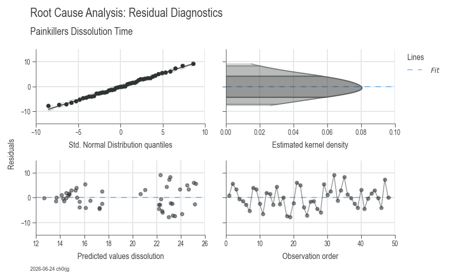
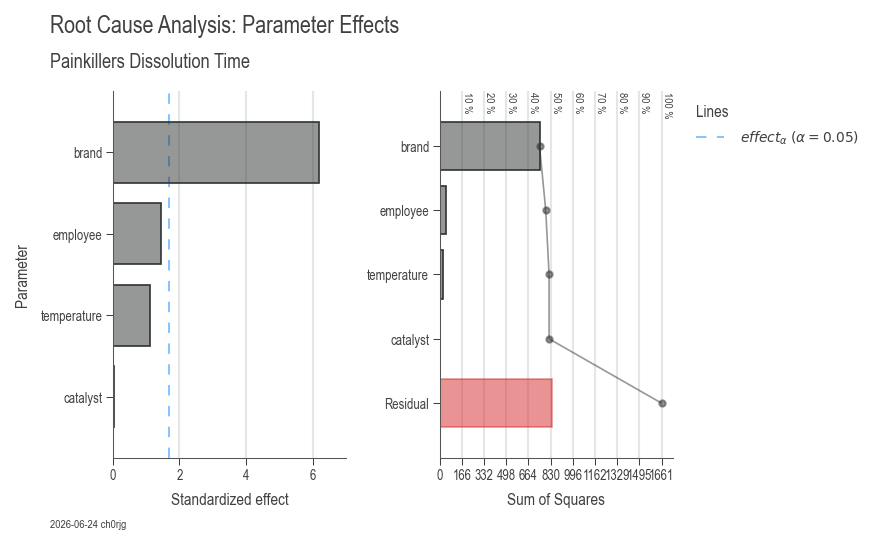

# Workflow 2: Root Cause Analysis

Root cause analysis identifies which factors (inputs) significantly impact your process output. This is the core of Six Sigma's "Analyze" phase and essential for data-driven decision making.

---

## When to Use This Workflow

- ✅ **Problem investigation:** Determine what's causing quality issues
- ✅ **Process optimization:** Find key drivers to focus improvement efforts
- ✅ **DMAIC Analyze phase:** Statistical confirmation of root causes
- ✅ **DOE analysis:** Evaluate experimental results and factor effects

---

## Quick Start (15 Lines)

```python
import daspi as dsp

# Load data with multiple factors
df = dsp.load_dataset("painkillers-dissolution")

# Fit model with automatic factor selection
model = dsp.LinearModel(
    source=df,
    target="dissolution",
    factors=["employee", "brand", "catalyst"],
    covariates=["temperature"]
)

# Remove non-significant factors automatically
model.recursive_elimination()

# Visualize results
dsp.ResidualsCharts(model).plot().stripes().label(info=True)
dsp.ParameterRelevanceCharts(model).plot().stripes().label(info=True)
```


*Residual diagnostics: 4-panel analysis validating model assumptions*


*Parameter effects: ANOVA table, effect sizes, and statistical significance*

---

## What You Get

### ResidualsCharts (Model Validation)
Ensures your model assumptions are valid:

1. **Residuals vs Fitted:** Check for patterns (should be random scatter)
2. **Q-Q Plot:** Verify normality of residuals
3. **Scale-Location:** Check homoscedasticity (constant variance)
4. **Residuals vs Leverage:** Identify influential outliers

### ParameterRelevanceCharts (Factor Analysis)
Shows which factors matter:

1. **Parameter estimates with confidence intervals**
2. **Effect sizes and statistical significance**
3. **ANOVA table** (F-statistics and p-values)
4. **R² values** (model fit quality)

**Automatic interpretation includes:**
- Significant vs non-significant factors
- Effect magnitude and direction
- Model quality metrics (R², adjusted R², predicted R²)
- Residual analysis diagnostics

---

## Understanding the Output

### ANOVA Table
The ANOVA table shows which factors significantly affect your output:

| Source | DF | SS | MS | F | p-value | η² |
|--------|----|----|----|----|---------|-----|
| Factor A | 2 | 1360.7 | 680.4 | 10.2 | 0.001 | 0.58 |
| Factor B | 1 | 234.5 | 234.5 | 3.5 | 0.082 | 0.12 |
| Residual | 15 | 1001.8 | 66.8 | - | - | 0.42 |

**Interpretation:**
- **p-value < 0.05:** Factor is statistically significant (reject H₀)
- **η² (eta-squared):** Proportion of variance explained (effect size)
- **F-statistic:** Ratio of explained to unexplained variance

### Goodness-of-Fit Metrics

- **R²:** Proportion of variance explained (0-1, higher is better)
- **Adjusted R²:** R² penalized for model complexity
- **Predicted R²:** Cross-validation estimate (avoid overfitting)
- **Target:** R² > 0.7 for good fit, adjusted R² ≈ predicted R²

---

## Real-World Example: Quality Investigation

```python
import daspi as dsp

# Load manufacturing data
df = dsp.load_dataset("painkillers-dissolution")

# Investigate dissolution time issues
model = dsp.LinearModel(
    source=df,
    target="dissolution",
    factors=[
        "employee",    # Categorical: who made it
        "stirrer",     # Categorical: equipment type
        "brand",       # Categorical: material supplier
        "catalyst",    # Categorical: process variant
        "water"        # Categorical: water type
    ],
    covariates=[
        "temperature",  # Continuous: process temperature
        "preparation"   # Continuous: prep time
    ],
    order=2,  # Include interaction effects
    alpha=0.05
)

# Backward elimination removes non-significant factors
df_elimination = model.recursive_elimination()
print(df_elimination)

# Visualize final model
residuals = dsp.ResidualsCharts(model
    ).plot(
    ).stripes(
    ).label(
        fig_title="Dissolution Time Root Cause Analysis",
        sub_title="Residual Diagnostics",
        info=True
    )

parameters = dsp.ParameterRelevanceCharts(model
    ).plot(
    ).stripes(
    ).label(
        fig_title="Dissolution Time Root Cause Analysis", 
        sub_title="Parameter Effects",
        info=True
    )

# Get ANOVA table
print(model.anova())

# Get parameter estimates
print(model.params())
```

---

## Advanced Analysis

### Interaction Effects

Interactions occur when the effect of one factor depends on the level of another:

```python
# Include 2-way interactions
model = dsp.LinearModel(
    source=df,
    target="yield",
    factors=["temperature", "pressure"],
    order=2  # Includes Temperature × Pressure
)
```

**Interpretation:**
- Significant interaction: Optimize factors together
- Non-significant interaction: Optimize factors independently

### Categorical vs Continuous Factors

```python
model = dsp.LinearModel(
    source=df,
    target="output",
    factors=["machine", "operator"],  # Categorical
    covariates=["speed", "feed"]      # Continuous
)
```

**Difference:**
- **Factors:** Discrete levels (compare groups)
- **Covariates:** Continuous (regression relationship)

### Model Comparison

```python
import pandas as pd

# Fit multiple models
model1 = dsp.LinearModel(source=df, target="y", factors=["A", "B"])
model2 = dsp.LinearModel(source=df, target="y", factors=["A", "B", "C"])
model3 = dsp.LinearModel(source=df, target="y", factors=["A", "B", "C"], order=2)

# Compare quality metrics
comparison = pd.DataFrame({
    'Model': ['A+B', 'A+B+C', 'A+B+C+interactions'],
    'R²': [model1.r2, model2.r2, model3.r2],
    'Adj R²': [model1.r2_adj, model2.r2_adj, model3.r2_adj],
    'Pred R²': [model1.r2_pred, model2.r2_pred, model3.r2_pred]
})
print(comparison)
```

---

## Interpretation Guidelines

### Residual Analysis

**✅ Good model:**
- Residuals randomly scattered (no patterns)
- Q-Q plot follows diagonal line (normal)
- No influential outliers (Cook's distance < 1)

**❌ Problem indicators:**
- Curved pattern → missing interaction or non-linear term
- Funnel shape → heteroscedasticity (transformation needed)
- Points far from Q-Q line → outliers or non-normality

### Statistical Significance

**p-value < 0.05:** Factor is significant
- Effect is real (not due to chance)
- Include in final model

**p-value ≥ 0.05:** Factor is not significant
- Effect indistinguishable from noise
- Consider removing (simplify model)

### Effect Size (η²)

- **η² > 0.14:** Large effect (factor has major impact)
- **0.06 < η² < 0.14:** Medium effect
- **η² < 0.06:** Small effect (may not be practically important)

---

## Common Issues & Solutions

### Issue: Non-normal residuals
**Causes:** Outliers, wrong model structure, non-normal data  
**Solutions:**
1. Check for outliers and investigate
2. Try transformation (log, sqrt, Box-Cox)
3. Add missing interaction terms

### Issue: Low R² despite significant factors
**Causes:** High inherent variation, missing factors  
**Solutions:**
1. Check measurement system capability (Gage R&R)
2. Identify additional factors (process mapping, brainstorming)
3. Improve process control to reduce noise

### Issue: Adjusted R² << Predicted R²
**Cause:** Overfitting (model too complex)  
**Solution:** Use backward elimination, reduce model complexity

### Issue: Multicollinearity warning
**Cause:** Highly correlated predictors  
**Solution:** Remove redundant factors, use VIF analysis

---

## Step-by-Step Workflow

### 1. Data Preparation
```python
# Load and inspect data
df = dsp.load_dataset("your_data")
print(df.info())
print(df.describe())
```

### 2. Fit Initial Model
```python
# Include all suspected factors
model = dsp.LinearModel(
    source=df,
    target="output",
    factors=["factorA", "factorB", "factorC"],
    covariates=["covariate1"],
    order=1  # Start without interactions
)
```

### 3. Check Model Fit
```python
# Visualize residuals
dsp.ResidualsCharts(model).plot().stripes().label(info=True)

# Check metrics
print(f"R² = {model.r2:.3f}")
print(f"Adj R² = {model.r2_adj:.3f}")
print(f"Pred R² = {model.r2_pred:.3f}")
```

### 4. Simplify Model
```python
# Remove non-significant factors
model.recursive_elimination(alpha=0.05)

# Review final model
print(model.anova())
```

### 5. Interpret Results
```python
# Visualize parameter effects
dsp.ParameterRelevanceCharts(model).plot().stripes().label(info=True)

# Get estimates with confidence intervals
params = model.params()
print(params[['estimate', 'ci_low', 'ci_upp', 'p']])
```

### 6. Validate & Implement
- Verify findings with confirmation runs
- Implement process changes based on key factors
- Monitor with SPC (Workflow 3)

---

## Next Steps

- **Workflow 1:** [Capability Analysis](workflow-capability.md) — Verify improvements
- **Workflow 3:** [SPC Charts](workflow-spc.md) — Monitor sustained improvement
- **Related:** [DOE Guide](doe.md) — Design experiments to test factor effects
- **Related:** [Hypothesis Testing](hypothesis-testing.md) — Statistical testing fundamentals
