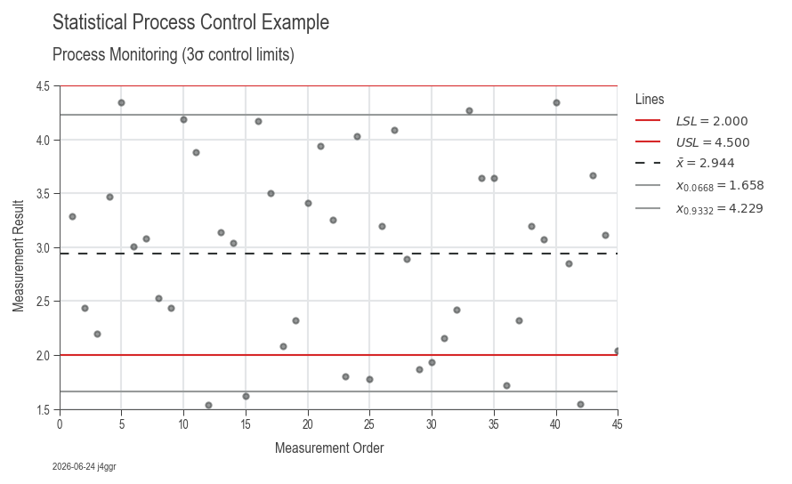

# Workflow 3: Statistical Process Control (SPC)

Statistical Process Control monitors process stability over time using control charts. This is essential for maintaining process improvements, detecting shifts early, and ensuring consistent quality.

---

## When to Use This Workflow

- ✅ **Process monitoring:** Track stability after improvement (DMAIC Control phase)
- ✅ **Early detection:** Identify out-of-control conditions before defects occur
- ✅ **Trend analysis:** Spot gradual process drift or degradation
- ✅ **Validation:** Demonstrate sustained process control to customers/auditors

---

## Quick Start (15 Lines)

```python
import daspi as dsp

# Load time-series process data
df = dsp.load_dataset("grnr_spc")

# Create control chart
chart = dsp.SingleChart(
    source=df,
    target="result",
    feature="measurement_order"
).plot(
    dsp.Scatter
).stripes(
    mean=True,
    control_limits=True,
    spec_limits=dsp.SpecLimits(lower=2.0, upper=4.5),
    agreement=3  # 3-sigma limits
).label(
    fig_title="SPC Chart: Process Monitoring",
    sub_title="Control limits at ±3σ",
    info=True
)
```


*Example output: Control chart with center line, UCL/LCL at ±3σ, and specification limits*

---

## What You Get

The control chart includes:

1. **Data points:** Individual measurements over time
2. **Center line (CL):** Process mean (green)
3. **Upper Control Limit (UCL):** Mean + 3σ (red dashed)
4. **Lower Control Limit (LCL):** Mean - 3σ (red dashed)
5. **Specification limits:** Customer requirements (if provided)
6. **Confidence bands:** Optional shading for statistical limits

**Automatic interpretation:**
- Points outside control limits (special cause variation)
- Trends and patterns (Western Electric rules)
- Process capability vs specifications
- Timestamp and statistical summary

---

## Understanding Control Charts

### Control Limits vs Specification Limits

**Control Limits (UCL/LCL):**
- Based on **actual process variation** (voice of the process)
- Calculated as: Mean ± 3σ
- Indicate **statistical stability**
- **Inside limits:** Common cause variation (random, inherent)
- **Outside limits:** Special cause variation (assignable, investigate)

**Specification Limits (USL/LSL):**
- Based on **customer requirements** (voice of the customer)
- Engineering/quality standards
- Indicate **acceptability**
- **Inside limits:** Acceptable product
- **Outside limits:** Defect (scrap or rework)

**Ideal situation:** Control limits well inside specification limits (capable + stable)

---

## Real-World Example: Manufacturing Monitoring

```python
import daspi as dsp

# Load ongoing process measurements
df = dsp.load_dataset("grnr_spc")

# Define specification limits from drawing
spec_limits = dsp.SpecLimits(lower=2.0, upper=4.5)

# Create comprehensive SPC chart
chart = dsp.SingleChart(
    source=df,
    target="result",
    feature="measurement_order",
).plot(
    dsp.Scatter,
    color='steelblue',
    s=40
).stripes(
    mean=True,                  # Show process mean
    median=False,               # Not needed for SPC
    control_limits=True,        # UCL/LCL at ±3σ
    spec_limits=spec_limits,    # Customer requirements
    confidence=0.997,           # 3-sigma = 99.7% confidence
    strategy='norm',            # Assume normal distribution
    agreement=3                 # 3-sigma control limits
).label(
    fig_title="Process Monitoring SPC Chart",
    sub_title="Production monitoring (3σ control limits)",
    feature_label="Measurement Order",
    target_label="Measurement Result",
    info=True
)

chart.save("spc_monitoring.png")
chart.show()
```

---

## Control Chart Types

### Individuals Chart (X-chart)
**Use when:** One measurement per subgroup, continuous data

```python
chart = dsp.SingleChart(
    source=df,
    target="measurement",
    feature="time"
).plot(dsp.Scatter).stripes(
    mean=True,
    control_limits=True,
    agreement=3
)
```

### X-bar and R Chart (Subgroups)
**Use when:** Multiple measurements per subgroup

```python
# Calculate subgroup means and ranges
df_grouped = df.groupby('subgroup').agg({
    'measurement': ['mean', lambda x: x.max() - x.min()]
})
df_grouped.columns = ['xbar', 'range']

# X-bar chart
dsp.SingleChart(
    source=df_grouped,
    target="xbar",
    feature=df_grouped.index
).plot(dsp.Scatter).stripes(
    mean=True,
    control_limits=True
).label(title="X-bar Chart")

# R chart
dsp.SingleChart(
    source=df_grouped,
    target="range",
    feature=df_grouped.index
).plot(dsp.Scatter).stripes(
    mean=True,
    control_limits=True
).label(title="R Chart")
```

### Comparison Across Groups
**Use when:** Monitoring multiple machines, shifts, or operators

```python
# Compare performance across production lines
chart = dsp.MultivariateChart(
    source=df,
    target="measurement",
    feature="time",
    col="machine",  # Separate chart per machine
).plot(
    dsp.Scatter
).stripes(
    mean=True,
    control_limits=True,
    spec_limits=spec_limits
).label(
    fig_title="Multi-Machine SPC Monitoring",
    col_title="Machine ID"
)
```

---

## Detecting Out-of-Control Conditions

### Western Electric Rules

1. **Rule 1:** One point beyond 3σ
   - **Action:** Investigate immediately, likely special cause

2. **Rule 2:** 2 out of 3 consecutive points beyond 2σ (same side)
   - **Action:** Possible process shift

3. **Rule 3:** 4 out of 5 consecutive points beyond 1σ (same side)
   - **Action:** Process trending

4. **Rule 4:** 8+ consecutive points on same side of center line
   - **Action:** Process shift or stratification

5. **Rule 5:** 6+ consecutive points steadily increasing/decreasing
   - **Action:** Trend (tool wear, temperature drift)

6. **Rule 6:** 14+ consecutive points alternating up/down
   - **Action:** Systematic variation (two alternating sources)

### Implementation in DaSPi

```python
# Manually check rules (automated detection coming soon)
import numpy as np

mean = df['measurement'].mean()
std = df['measurement'].std()

ucl = mean + 3 * std
lcl = mean - 3 * std

# Rule 1: Points beyond 3-sigma
outliers = df[(df['measurement'] > ucl) | (df['measurement'] < lcl)]
if len(outliers) > 0:
    print(f"⚠️ Rule 1 violation at samples: {outliers.index.tolist()}")

# Rule 4: 8 consecutive points on same side
above_mean = (df['measurement'] > mean).astype(int)
consecutive = (above_mean.diff() == 0).sum()
if consecutive >= 8:
    print(f"⚠️ Rule 4 violation: {consecutive} consecutive points on same side")
```

---

## Advanced Control Chart Features

### Custom Sigma Levels

```python
# 2-sigma limits (more sensitive, more false alarms)
chart.stripes(
    control_limits=True,
    agreement=2
)

# 6-sigma limits (less sensitive, fewer false alarms)
chart.stripes(
    control_limits=True,
    agreement=6
)
```

### Alternative Distribution Strategies

```python
# Auto-fit best distribution
chart.stripes(
    control_limits=True,
    strategy='fit',
    possible_dists=('norm', 'lognorm', 'weibull_min')
)

# Use empirical data quantiles (non-parametric)
chart.stripes(
    control_limits=True,
    strategy='data',
    agreement=0.997  # 99.7% (equivalent to 3-sigma)
)
```

### Phase Separation

```python
# Compare before/after improvement
chart = dsp.SingleChart(
    source=df,
    target="measurement",
    feature="time",
    hue="phase"  # Phase 1 = before, Phase 2 = after
).plot(dsp.Scatter).stripes(
    mean=True,
    control_limits=True
).label(
    fig_title="Process Improvement Validation",
    sub_title="Before vs After comparison"
)
```

---

## Interpretation Guidelines

### In-Control Process
✅ All points within control limits  
✅ Random scatter (no patterns)  
✅ Approximately equal points above/below mean  
**Action:** Continue monitoring, no intervention needed

### Out-of-Control Process
❌ Points beyond control limits  
❌ Trends or runs  
❌ Sudden shifts in level or variation  
**Action:** Investigate and eliminate special cause

### Capable But Unstable
✅ Within specification limits  
❌ Outside control limits or patterns  
**Problem:** Process meets specs but unpredictable  
**Action:** Find and eliminate special causes

### Stable But Incapable
✅ Within control limits (stable)  
❌ Outside specification limits (defects)  
**Problem:** Predictable but doesn't meet requirements  
**Action:** Reduce common cause variation (process improvement)

---

## Common Issues & Solutions

### Issue: Too many false alarms
**Cause:** Control limits too tight  
**Solutions:**
- Verify measurement system capability (Gage R&R)
- Consider 4-sigma or 6-sigma limits for less critical processes
- Ensure sufficient baseline data (minimum 20-25 points)

### Issue: No points outside limits but process drifting
**Cause:** Missing trend patterns  
**Solutions:**
- Apply Western Electric rules
- Reduce control limit width temporarily
- Implement automated trend detection

### Issue: Control limits wider than spec limits
**Cause:** Process variation too high (incapable)  
**Solutions:**
- Root cause analysis (Workflow 2) to reduce variation
- Process redesign or equipment upgrade
- Tighter tolerances on input materials

### Issue: Stratification (clustering)
**Cause:** Multiple populations mixed (shifts, machines, materials)  
**Solutions:**
- Separate charts by source (use `hue` or `col`)
- Investigate and standardize sources
- Rational subgrouping

---

## SPC Implementation Checklist

### Phase 1: Baseline Establishment
1. ✅ Collect baseline data (20-25 points minimum)
2. ✅ Verify process in statistical control
3. ✅ Calculate initial control limits
4. ✅ Document baseline performance

### Phase 2: Monitoring
1. ✅ Plot new data on control chart
2. ✅ Check for out-of-control signals
3. ✅ Investigate special causes immediately
4. ✅ Update control limits if process improves

### Phase 3: Response
1. ✅ Develop Out-of-Control Action Plan (OCAP)
2. ✅ Define investigation procedures
3. ✅ Assign responsibilities
4. ✅ Document corrective actions

---

## Integration with Other Workflows

### After Root Cause Analysis (Workflow 2)
```python
# 1. Identify key factors
model = dsp.LinearModel(source=df, target="y", factors=["A", "B"])
model.recursive_elimination()

# 2. Implement improvements to key factors

# 3. Establish SPC monitoring on output
chart = dsp.SingleChart(
    source=df_after,
    target="y",
    feature="time"
).plot(dsp.Scatter).stripes(
    mean=True,
    control_limits=True
).label(title="SPC Monitoring Post-Improvement")
```

### With Capability Analysis (Workflow 1)
```python
# Step 1: Verify stability with SPC
spc_chart = dsp.SingleChart(
    source=df,
    target="measurement",
    feature="sample"
).plot(dsp.Scatter).stripes(
    mean=True,
    control_limits=True
)

# Step 2: Calculate capability (only valid if stable!)
if process_is_stable:  # Manual verification
    capability = dsp.ProcessCapabilityAnalysisCharts(
        source=df,
        target="measurement",
        spec_limits=spec_limits
    ).plot().stripes().label(info=True)
```

---

## Real-Time Monitoring Setup

```python
import daspi as dsp
import time

# Setup: Define monitoring parameters
spec_limits = dsp.SpecLimits(lower=45, upper=55)
baseline_data = []  # Collect 20-25 baseline points first

# Ongoing monitoring loop (pseudo-code)
while True:
    # Collect new measurement
    new_measurement = measure_process()
    baseline_data.append(new_measurement)
    
    # Update chart
    df_current = pd.DataFrame({'measurement': baseline_data[-30:]})
    chart = dsp.SingleChart(
        source=df_current,
        target="measurement",
        feature=range(len(df_current))
    ).plot(dsp.Scatter).stripes(
        mean=True,
        control_limits=True,
        spec_limits=spec_limits
    ).label(
        fig_title=f"Live SPC Monitoring ({time.strftime('%Y-%m-%d %H:%M')})"
    )
    
    # Check for out-of-control
    mean = df_current['measurement'].mean()
    std = df_current['measurement'].std()
    ucl = mean + 3 * std
    lcl = mean - 3 * std
    
    if new_measurement > ucl or new_measurement < lcl:
        print("⚠️ OUT OF CONTROL - INVESTIGATE!")
        # Trigger alert, log event, etc.
    
    time.sleep(300)  # Check every 5 minutes
```

---

## Next Steps

- **Workflow 1:** [Capability Analysis](workflow-capability.md) — Evaluate process performance
- **Workflow 2:** [Root Cause Analysis](workflow-root-cause.md) — Reduce variation sources
- **Related:** [3S Stabilize Phase](3s-stabilize.md) — Sustain improvements systematically
